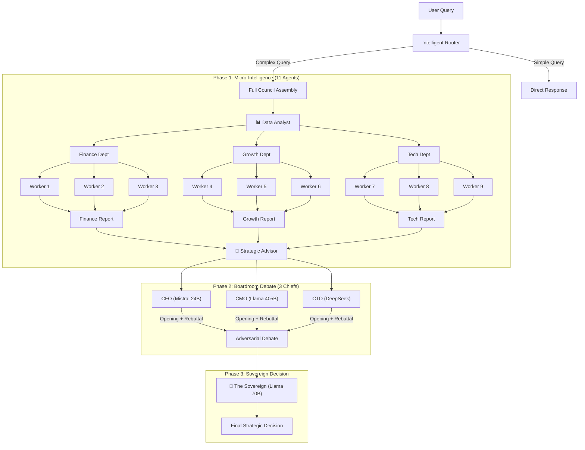

# The Sovereign Extraction Engine 👑🤖

> **Architecture:** Hierarchical Multi-Agent Debate System (DSPy)  
> **Core Focus:** Autonomous Strategic Decision-Making via AI Council  
> **Status:** Proof of Concept (POC) Framework

## 🎯 The Core Philosophy

This project demonstrates a **"Council of Kings"** approach to AI decision-making. Instead of relying on a single LLM, we orchestrate **15 specialized agents** in a structured debate system that mimics corporate governance.

**The Sovereign Engine** solves the "single point of failure" problem by:
1. **Distributed Intelligence:** 9 workers + 2 specialists + 3 chiefs + 1 sovereign
2. **Adversarial Debate:** Chiefs argue and rebut each other before final decision
3. **Configurable Strategy:** The Sovereign can adopt different personas (cost-focused, growth-focused, balanced)

## 🏗️ System Architecture

### Two-Phase Council Pattern



### Key Features

| Feature | Description |
|---------|-------------|
| **Intelligent Router** | Scores query complexity (1-10) and routes to FAST_LANE or DEEP_LANE |
| **Specialist Agents** | Data Analyst (quantitative insights) + Strategic Advisor (meta-analysis) |
| **Peer Review** | Workers cross-review each other's drafts with scores before boss synthesis |
| **Adversarial Debate** | Chiefs give opening arguments, then rebuttals attacking each other's logic |
| **Sovereign Personas** | Configurable decision strategies (Balanced / Wartime / Visionary) |
| **RAG Integration** | ChromaDB vector store with semantic search and department filtering |

### Sovereign Personas

The Sovereign can be configured with different strategic lenses:

- ⚖️ **The Balanced Architect** - Seek sustainable compromises
- ⚔️ **The Wartime General** - Prioritize cash preservation, be risk-averse
- 🚀 **The Silicon Visionary** - Prioritize growth, burn cash to win

## 🛠️ Tech Stack

| Component | Technology |
|-----------|------------|
| **Orchestration** | DSPy (Programmatic Prompting) |
| **LLM Backend** | OpenRouter (Cloud) / Ollama (Local) |
| **Frontend** | Streamlit Dashboard |
| **Config** | python-dotenv |

### Models Used

| Role | Model |
|------|-------|
| Workers | Mistral 7B, Llama 3.2 3B, Llama 3.3 70B |
| CFO | Mistral Small 24B |
| CMO | Llama 3.1 405B (Hermes) |
| CTO | DeepSeek |
| Sovereign | Llama 3.3 70B |

## 📁 Project Structure

```
├── demo-cloud-version/    # Production-ready implementation (actively developed)
│   ├── config.py          # Model configuration & API setup
│   ├── micro_council.py   # Department workers + peer review + specialists
│   ├── macro_council.py   # Chiefs debate + Sovereign decision
│   ├── router.py          # Query complexity router with error handling
│   ├── retriever.py       # ChromaDB vector store implementation
│   └── dashboard.py       # Streamlit UI with 4-phase workflow
│
├── sovereign-engine/      # Local POC (reference implementation)
│   └── (same structure)   # Demonstrates local-first architecture
│
└── README.md
```

### Implementation Status

| Version | `demo-cloud-version/` | `sovereign-engine/` |
|---------|----------------------|---------------------|
| **Status** | ✅ Production-ready showcase | 📚 POC reference implementation |
| **Agent Count** | 15 agents (fully implemented) | 13 agents (documented architecture) |
| **RAG** | ✅ ChromaDB with semantic search | 📝 Architecture documented |
| **Error Handling** | ✅ Retry logic with exponential backoff | 📝 Basic implementation |
| **Async Execution** | ✅ Parallel API calls with asyncio | ❌ Sequential execution |
| **Router Integration** | ✅ FAST_LANE/DEEP_LANE routing | ✅ Implemented |
| **Purpose** | Demonstrate production patterns | Show local-first approach |

## 🎓 Portfolio Showcase

This repository demonstrates **advanced AI engineering patterns** through a fully-functional multi-agent system. The `demo-cloud-version/` is production-ready code showcasing professional implementation of:

### Technical Implementations Demonstrated

| Pattern | Implementation |
|---------|----------------|
| **DSPy Orchestration** | Programmatic prompting with typed signatures instead of string templates |
| **Hierarchical Multi-Agent** | 15-agent council with micro → macro → sovereign decision flow |
| **Async Parallelization** | `asyncio.gather()` for concurrent API calls (3 drafts + 6 reviews in parallel) |
| **Error Resilience** | Exponential backoff retry logic on all LLM calls (3 attempts, 1s/2s/4s delays) |
| **Intelligent Routing** | Complexity-based query routing to optimize API costs (FAST_LANE vs DEEP_LANE) |
| **RAG Architecture** | ChromaDB vector store with semantic search and metadata filtering |
| **Adversarial Debate** | Cross-examination pattern with opening arguments and rebuttals |
| **Chain-of-Thought** | Transparent reasoning visible in Sovereign's internal monologue |

### Architecture Philosophy

The `sovereign-engine/` folder exists as a **reference architecture** for local-first, privacy-centric deployment (air-gapped with Ollama). It demonstrates the same council pattern but is intentionally kept as a documented POC to showcase architectural flexibility.

**Focus:** This project emphasizes **AI workflow design** and **production engineering patterns**, not end-user deployment.

## 🔒 Local-First Architecture (Reference)

The `sovereign-engine/` demonstrates architectural patterns for privacy-sensitive deployments:

- **Air-Gapped Capable:** Designed for 100% offline operation via Ollama
- **Zero Cloud Dependency:** Architecture ensures data never leaves local infrastructure
- **Compliance-Aware:** Pattern suitable for GDPR, HIPAA, and regulated environments
- **Legacy Integration:** Demonstrates output formatting for enterprise systems

*Note: This is a reference architecture showing how the council pattern adapts to local-first constraints.*

## 💡 Example Use Case

**Query:** "Should we pause the AWS migration to save cash?"

**Process:**
1. Router scores complexity → DEEP_LANE (score: 7.5)
2. Data Analyst extracts quantitative metrics from knowledge base
3. 9 workers draft departmental analysis with peer review
4. Strategic Advisor performs meta-analysis across all reports
5. CFO, CMO, CTO debate with openings and rebuttals
6. Sovereign (in "Wartime General" mode) synthesizes final decision

**Output:** Strategic recommendation balancing all perspectives with transparent reasoning.
