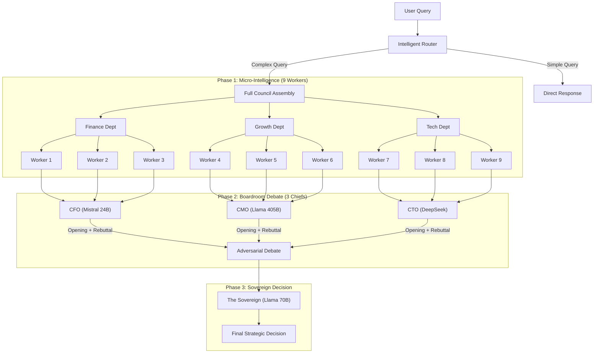

# The Sovereign Extraction Engine 👑🤖

> **Architecture:** Hierarchical Multi-Agent Debate System (DSPy)  
> **Core Focus:** Autonomous Strategic Decision-Making via AI Council  
> **Status:** Proof of Concept (POC) Framework

## 🎯 The Core Philosophy

This project demonstrates a **"Council of Kings"** approach to AI decision-making. Instead of relying on a single LLM, we orchestrate **13+ specialized agents** in a structured debate system that mimics corporate governance.

**The Sovereign Engine** solves the "single point of failure" problem by:
1. **Distributed Intelligence:** 3 departments × 3 workers + 3 chiefs + 1 sovereign
2. **Adversarial Debate:** Chiefs argue and rebut each other before final decision
3. **Configurable Strategy:** The Sovereign can adopt different personas (cost-focused, growth-focused, balanced)

## 🏗️ System Architecture

### Two-Phase Council Pattern



### Key Features

| Feature | Description |
|---------|-------------|
| **Intelligent Router** | Scores query complexity (1-10) and routes to FAST_LANE or DEEP_LANE |
| **Peer Review** | Workers cross-review each other's drafts with scores before boss synthesis |
| **Adversarial Debate** | Chiefs give opening arguments, then rebuttals attacking each other's logic |
| **Sovereign Personas** | Configurable decision strategies (Balanced / Wartime / Visionary) |
| **RAG Integration** | Each department retrieves context from a shared knowledge graph |

### Sovereign Personas

The Sovereign can be configured with different strategic lenses:

- ⚖️ **The Balanced Architect** - Seek sustainable compromises
- ⚔️ **The Wartime General** - Prioritize cash preservation, be risk-averse
- 🚀 **The Silicon Visionary** - Prioritize growth, burn cash to win

## 🛠️ Tech Stack

| Component | Technology |
|-----------|------------|
| **Orchestration** | DSPy (Programmatic Prompting) |
| **LLM Backend** | OpenRouter (Cloud) / Ollama (Local) |
| **Frontend** | Streamlit Dashboard |
| **Config** | python-dotenv |

### Models Used

| Role | Model |
|------|-------|
| Workers | Mistral 7B, Llama 3.2 3B, Llama 3.3 70B |
| CFO | Mistral Small 24B |
| CMO | Llama 3.1 405B (Hermes) |
| CTO | DeepSeek |
| Sovereign | Llama 3.3 70B |

## 📁 Project Structure

```
├── demo-cloud-version/    # Cloud version using OpenRouter API
│   ├── config.py          # Model configuration & API setup
│   ├── micro_council.py   # Department workers + peer review
│   ├── macro_council.py   # Chiefs debate + Sovereign decision
│   ├── router.py          # Query complexity router
│   ├── retriever.py       # RAG context retrieval
│   └── dashboard.py       # Streamlit UI
│
├── sovereign-engine/      # Local version using Ollama
│   └── (same structure)   # Air-gapped, privacy-focused
│
└── README.md
```

### Which Version Should I Use?

| Version | `demo-cloud-version/` | `sovereign-engine/` |
|---------|----------------------|---------------------|
| **Use Case** | Rapid prototyping & testing | Production & sensitive data |
| **LLM Backend** | OpenRouter (cloud API) | Ollama (local inference) |
| **Internet** | Required | Not required (air-gapped) |
| **Cost** | Pay per token | Free (your hardware) |
| **Privacy** | Data sent to cloud | Data never leaves server |
| **Best For** | Development, demos | Legal, Finance, Healthcare |

## ⚙️ Setup

### 1. Install Dependencies

```bash
pip install dspy-ai streamlit python-dotenv
```

### 2. Configure API Key (Cloud Version)

```bash
export OPENROUTER_API_KEY="your-api-key-here"
```

Or create a `.env` file in `demo-cloud-version/`:
```
OPENROUTER_API_KEY=your-api-key-here
```

### 3. Run the Dashboard

**Cloud Version:**
```bash
cd demo-cloud-version
streamlit run dashboard.py
```

**Local Version (requires Ollama running):**
```bash
cd sovereign-engine
streamlit run dashboard.py
```

## 🔒 Privacy & Local Inference

For production environments with strict data requirements, use `sovereign-engine/`:

- **Air-Gapped Ready:** 100% offline operation via Ollama
- **No Cloud Dependency:** Data never leaves your server
- **Legacy Integration:** Outputs JSON/CSV/XML for existing systems
- **Compliance Ready:** Suitable for GDPR, HIPAA, and other regulatory environments

## 💡 Example Use Case

**Query:** "Should we pause the AWS migration to save cash?"

**Process:**
1. Router scores complexity → DEEP_LANE (score: 7.5)
2. 9 workers draft departmental analysis with peer review
3. CFO, CMO, CTO debate with openings and rebuttals
4. Sovereign (in "Wartime General" mode) synthesizes final decision

**Output:** Strategic recommendation balancing all perspectives with transparent reasoning.
