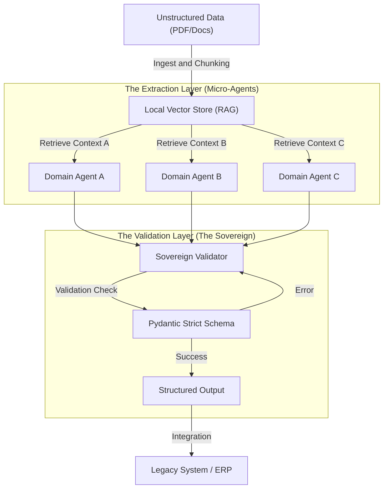

# The Sovereign Extraction Engine 🏗️🤖

> **Architecture:** Hierarchical Multi-Agent System (DSPy)
> **Core Focus:** Local-Only Privacy, RAG, and Deterministic Data Extraction
> **Status:** Proof of Concept (POC) Framework

## 🎯 The Core Philosophy
Dette projekt demonstrerer en **"Domain-First" tilgang til AI-arkitektur**.
Mange virksomheder fejler med AI, fordi de anvender generiske "Chat"-modeller til specifikke, strukturerede opgaver.

**The Sovereign Engine** løser problemet ved at kombinere **RAG (Retrieval-Augmented Generation)** med en stram **Multi-Agent struktur**, der sikrer:
1.  **Total Privacy:** Designet til at køre 100% offline (Air-gapped) via lokale LLM'er (Ollama).
2.  **Determinisme:** Erstatter "sandsynlighed" med "struktur" via Pydantic-skemaer.
3.  **Modularitet:** Kan hurtigt omstilles fra ét domæne (f.eks. Jura) til et andet (f.eks. Finans eller Sundhed).

## 🏗️ System Architecture
Systemet er bygget som en "Samlebånds-fabrik" snarere end en chatbot. Det nedbryder komplekse dokumenter til mikro-opgaver.

### The "Council" Pattern
I stedet for én stor model, bruger arkitekturen specialiserede mikro-agenter styret af en "Sovereign" validator.



## 🔒 Privacy & Local Inference
Denne arkitektur er designet specifikt til sektorer med høje sikkerhedskrav (Advokater, Offentlig Forvaltning, Finans).

- **No Cloud Dependency:** Motoren er testet med Llama 3 (Quantized) kørt lokalt via Ollama.
- **Air-Gapped Ready:** Kræver ingen internetforbindelse under inference. Data forlader aldrig serveren.
- **Legacy Integration:** Fungerer som en "Sidecar"-applikation, der ikke kræver omskrivning af eksisterende IT-systemer, men leverer data via standardformater (JSON/CSV/XML).

## 🛠️ Tech Stack & Implementation
Dette repo viser min forståelse for moderne AI-orkestrering:

| Component | Technology |
|-----------|------------|
| **Orchestration** | DSPy (Programmatic Prompting frem for manuel prompt engineering) |
| **LLM Backend** | Agnostisk - understøtter både OpenRouter (Prototyping) og Ollama (Production/Local) |
| **Data Validation** | Pydantic (sikrer datatype-integritet før output) |
| **Frontend** | Streamlit (til hurtig prototyping og "Human-in-the-loop" validering) |

## ⚙️ Setup

Set your OpenRouter API key as an environment variable:

```bash
export OPENROUTER_API_KEY="your-api-key-here"
```

## 💡 Use Case Example: "Project LeaseAI"
Som en demonstration af arkitekturens fleksibilitet, er repoet konfigureret til at løse problemet: "Struktureret dataudtræk fra Erhvervslejekontrakter".

- **Input:** 50+ siders ustruktureret juridisk tekst.
- **Output:** 40+ validerede datapunkter mappet til branchestandarden (Unik Bolig).
- **Resultat:** Demonstrerer evnen til at håndtere kompleks domæne-logik (f.eks. dansk lejelovgivning) i en automatiseret pipeline.
